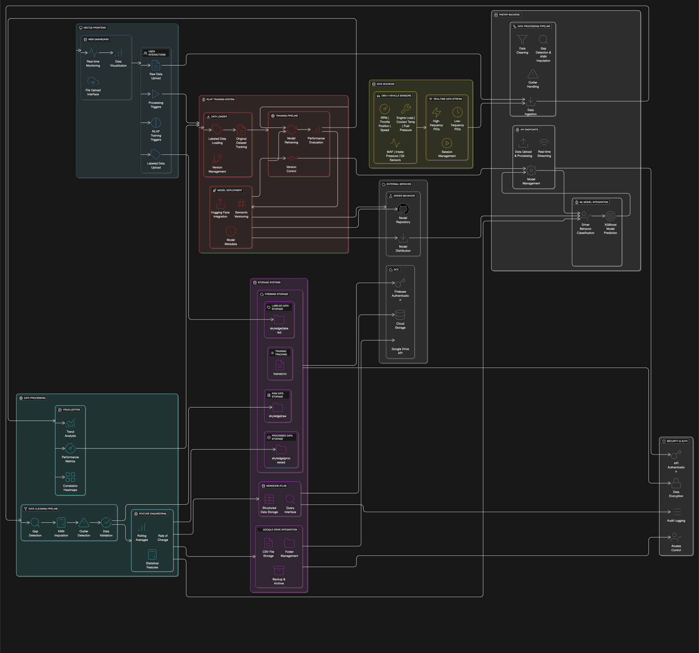
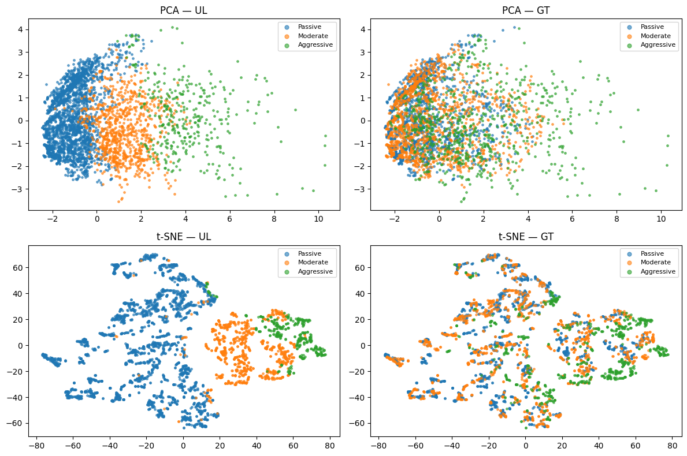

# 🚗 OBD-II Logging & Processing API

This project is a **FastAPI-based backend** on Hugging Face Space for collecting and processing real-time OBD-II vehicle data streamed from a Raspberry Pi. It performs data cleaning, feature engineering, and saves the final result to **Google Drive**.

Access [Hugging Face](https://huggingface.co/spaces/BinKhoaLe1812/OBD_Logger) repo



---

## ⚙️ Features
* Real-time OBD-II data ingestion
* Background task for cleaning and normalizing logs
* Feature engineering (e.g., TEMP\_MEAN, AIRFLOW\_PER\_RPM)
* Seamless Google Drive upload for CSV archives
* Built-in logging and health endpoint

---
## 🏷️ Driver Behavior Labelling

### 💡 Purpose
Why do we need Unsupervised Learning (UL) when already have fairly good labelling  quality (Ground Truth / GT)?


*Applying UL techniques reduce overlap, enhance clustering and accuracy, leveraged from GT*

### 🏆 Outcome
We trained 2 XGBoost models with great accuracies:

  
*High accuracy from UL model*

  
*High accuracy from GT model*

Note that these 2 models on inference must be fused with 3 variants:
- scaler
- encoder
- classifier

Model directory:
[UL](https://github.com/benty691/EAT40005/tree/main/model/ul)   |   [GT](https://github.com/benty691/EAT40005/tree/main/model/gt)

---

## 🧰 API Setups

### 1. 🔐 Google Drive Access Setup
* Download the **JSON key file** for **Google Cloud Service Account**.

---

### 2. 🐳 Deploying to Hugging Face Spaces (Docker)

> Find more at `app.py`, `requirements.txt`, and `Dockerfile`.

---

## 🔁 Data Pipeline

```bash
graph TD
A[OBD-II Device] --> B[Raspberry Pi Python script]
B --> |POST /ingest| C[FastAPI App]
C --> D[raw_logs.csv]
C --> |Background Task| E[Processing Pipeline]
E --> F[cleaned_<timestamp>.csv]
F --> G[Google Drive (OBD Cleaned Logs)]
F --> H[MongoDB (OBD Cleaned Logs)]
```

---

## 🚀 API Endpoints

| Method | Endpoint       | Description                       |
| ------ | -------------- | --------------------------------- |
| POST   | `/ingest`      | Accept OBD-data streaming in JSON |
| POST   | `/upload-csv`  | Accept bulk CSV file              |
| GET    | `/health`      | Health check (status: "ok")       |
| GET    | `/download/{f}`| Download filename `f`             |

---

## 📑 JSON Schema Example (for streaming)

```json
{
  "timestamp": "2025-05-15T13:45:22",
  "driving_style": "aggressive",
  "data": {
    "RPM": 2450,
    "THROTTLE_POS": 23.4,
    "FUEL_PRESSURE": 33.5,
    ...
  }
}
```

---

## 🧼 Cleaning Highlights

* Drop constant/fully missing columns
* Clip outliers (e.g., RPM < 100 or > 6000)
* Drop rows with >80% missing values
* Fill missing numeric values with medians
* Normalize all numeric features using `MinMaxScaler`

---

## 🧠 Feature Engineering

* `TEMP_MEAN`: Mean of intake, oil, and coolant temps
* `AVG_ENGINE_LOAD`: Mean of engine and absolute load
* `AIRFLOW_PER_RPM`: MAF-to-RPM ratio

---

## 🐱 Git Push for HF Space repo:
**Set remote (Only Once):**
```bash
cd OBD_Logger
git remote add hf https://huggingface.co/spaces/BinKhoaLe1812/OBD_Logger
cd ..
```
**Next time staging and pushes**
```bash
git add OBD_Logger 
git subtree split --prefix=OBD_Logger -b hf-deploy
git push hf hf-deploy:main --force
```

## 🎥 Data Streaming Simulation:
1. Direct post with CURL (1 entry only): 
```bash
curl -X POST https://binkhoale1812-obd-logger.hf.space/ingest \
     -H "Content-Type: application/json" \
     -d @OBD_Logger/data.json
```

2. Streaming with Python app (15s, 0.2s per log:)
```bash
python3 stream.py
```

3. Non-streamingm, bulking CSV:
```bash
curl -X POST https://binkhoale1812-obd-logger.hf.space/upload-csv/ \
     -H "accept: application/json" \
     -H "Content-Type: multipart/form-data" \
     -F "file=@sample_log.csv"
```

**From logs folder**
```bash
curl -X POST https://binkhoale1812-obd-logger.hf.space/upload-csv/ \
     -H "accept: application/json" \
     -H "Content-Type: multipart/form-data" \
     -F "file=@logs/driver_behavior_s2w5/style1.csv"
```

## Merging all cleaned logs:
```bash
python merge_logs.py
```
